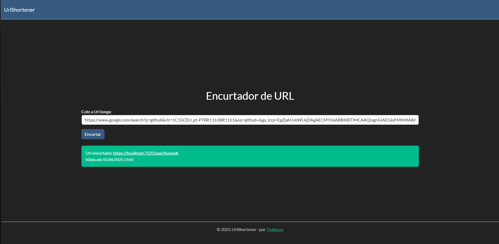

# 🔗 UrlShortener

Um projeto simples e funcional de encurtador de URLs, desenvolvido com **ASP.NET Core MVC**, utilizando **Entity Framework Core**, **SQL Server** e estilizado com o tema **Minty** do **Bootswatch**.

✨ Funcionalidades — Como foram implementadas

- Transformação de URLs longas em links curtos e fáceis de compartilhar  
  A URL longa é recebida via formulário. O sistema gera um código aleatório (ex: 6 caracteres) usando uma função com letras e números. Esse código é salvo no banco junto com a URL original, e é usado para criar o link encurtado (ex: localhost:5158/abc123).

- Redirecionamento automático ao acessar a URL encurtada  
  Quando o usuário acessa o link curto, o sistema extrai o código (ex: abc123), busca no banco pela URL correspondente e realiza o redirecionamento usando Redirect() no backend.

- Validade das URLs encurtadas por **15 dias**  
  Ao criar a URL encurtada, é salva também a data de expiração (data atual + 15 dias). No momento do redirecionamento, o sistema verifica se a URL ainda está válida antes de redirecionar. Caso esteja expirada, retorna uma mensagem de erro ou página personalizada.

- Layout responsivo, moderno e com animações suaves  
  O frontend foi feito com HTML, CSS, Bootstrap 4 e JavaScript/jQuery. O layout se adapta a diferentes tamanhos de tela e inclui transições suaves, além de um modo escuro opcional para melhor experiência visual.


## 📸 Demonstração



## ⚙️ Tecnologias Utilizadas

- **ASP.NET Core MVC**
- **Entity Framework Core**
- **SQL Server**
- **Bootstrap 5 (Darkly Theme - Bootswatch)**
- **JavaScript** e **jQuery**

## 🧩 Como Clonar e Iniciar o Projeto

Para testar e modificar o projeto localmente, siga os passos abaixo:

1. **Clone o repositório:**

```bash
git clone https://github.com/Kozahb/UrlShortener.git
```

2. Entre na pasta do projeto:
```bash
cd UrlShortener
```

3. Configure a string de conexão com seu banco SQL Server: Abra o arquivo appsettings.json e ajuste a string de conexão na seção "ConnectionStrings" para apontar para o seu servidor SQL Server local.
Exemplo:
```json
"ConnectionStrings": {
  "DefaultConnection": "Server=localhost;Database=UrlShortenerDb;Trusted_Connection=True;"
}
```

4. Execute as migrações para criar o banco de dados:
 No terminal, rode o comando:
```bash
dotnet ef database update
```

5. Execute a aplicação:
```bash
dotnet run
```

6. Após executar o comando acima, observe no terminal a URL onde a aplicação está rodando, que geralmente será algo como: 
```
https://localhost:5001
```


Este projeto foi desenvolvido como parte de um exercício prático para aprimorar conhecimentos em ASP.NET Core e boas práticas de desenvolvimento web.

## 👨‍💻 Autor

Desenvolvido por **Thaleson Eduardo**  
[🔗 LinkedIn](https://www.linkedin.com/in/thalesoneduardo)  
[💼 GitHub](https://github.com/Kozahb)
